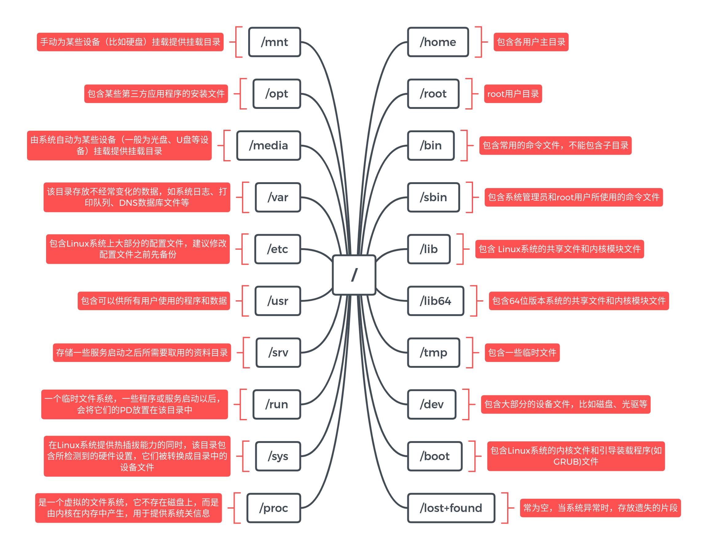

# Linux基础知识

## linux文件系统



## Linux常用命令

### ls指令

含义：在列出指定路径下的文件文件夹的名称，并以指定的格式进行显示。

-l ：表示 list ，表示以详细列表的形式进行展示

-a ：表示显示所有的文件 文件夹（包含了隐藏文件 文件夹）

-h： 以 可读性较高的形式显示

```bash
ls
ls -a
ls -l 
ls -al
ls -lh 
ls -l /home/ubuntu/
```

### **pwd 指令**

```bash
pwd
```

### **cd 指令**

语法：$cd 路径

```bash
cd /home/ubuntu
```

### mkdir指令

语法1：**$mkdir 路径**   【可以是文件夹名称也可以是包含名称的一个完整路径】

语法2：**$mkdir -p** **路径**   嵌套创建

语法3：**$mkdir** **路径1** **路径2** **路径3 ….**  【表示一次性创建多个目录】

```bash
$mkdir 123
$mkdir -p 123/456
$mkdir 123 456 789
```

### touch指令

语法：**$touch** **文件路径**   【路径可以是直接的文件名也可以是路径】

### cp指令

语法：**$cp**  **被复制的文档路径**   **文档被复制到的路径**

cp命令进行文件夹复制操作的时候需要添加选项“-r”

```bash
cp ./123 /home/123
cp -r ./dir/ /home/dir
```

### mv指令

**$mv 需要移动的文档路径 需要保存的位置路径**

```bash
mv 1.txt /home/1.txt
mv ./dir/ /home/
```

### rm指令

语法：$rm 选项 需要移除的文档路径

选项：

​    -f：force，强制删除，不提示是否删除

​    -r：表示递归

```bash
rm -rf /
```

### 输出重定向

**一般命令的输出都会显示在终端中，有些时候需要将一些命令的执行结果想要保存到文件中进行后续的分析/统计，则这时候需要使用到的输出重定向技术。**

\>：覆盖输出，会覆盖掉原先的文件内容

\>>：追加输出，不会覆盖原始文件内容，会在原始内容末尾继续添加

**语法：$****正常执行的指令 > / >>** **文件的路径**

注意：文件可以不存在，不存在则新建

```bash
ls -al > ls.txt
ls -al >> ls.txt
```

### cat指令

作用1：cat有直接打开一个文件的功能。
语法1：$cat 文件的路径

作用2：cat还可以对文件进行合并
语法2：$cat 待合并的文件路径1 待合并的文件路径2 …. 文件路径n > 合并之后的文件路径

```bash
cat 1.c
cat 1.c 2.c 3.c > n.c
```

### 解压命令

**1、.tar** 

```javascript
解包：tar xvf FileName.tar
打包：tar cvf FileName.tar DirName
（注：tar是打包，不是压缩！）
```

**2、.gz**

```javascript
解压1：gunzip FileName.gz
解压2：gzip -d FileName.gz
压缩：gzip FileName
```

**3、.tar.gz 和 .tgz**

```javascript
解压：tar zxvf FileName.tar.gz
压缩：tar zcvf FileName.tar.gz DirName
```

**4、.bz2**

```javascript
解压1：bzip2 -d FileName.bz2
解压2：bunzip2 FileName.bz2
压缩： bzip2 -z FileName
```

**5、.tar.bz2**

```javascript
解压：tar jxvf FileName.tar.bz2
压缩：tar jcvf FileName.tar.bz2 DirName
```

**6、.bz**

```javascript
解压1：bzip2 -d FileName.bz
解压2：bunzip2 FileName.bz
```

**7、.tar.bz**

```javascript
解压：tar jxvf FileName.tar.bz
```

**8、.zip**

```javascript
解压：unzip FileName.zip
压缩：zip FileName.zip DirName
```

**11、.rar**

```javascript
解压：rar x FileName.rar
压缩：rar a FileName.rar DirName
```


## Linux 进阶命令

### df指令

作用：查看磁盘的空间
语法：$df -h		-h表示以可读性较高的形式展示大小

```bash
df -h
```

### free指令

作用：查看内存使用情况
语法：$free -m   -m表示以mb为单位查看

```bash
free -m
```

### head指令

作用：查看一个文件的前n行，如果不指定n，则默认显示前10行。
语法：$head -n 文件路径   【n表示数字】

### tail指令

作用1：查看一个文件的未n行，如果n不指定默认显示后10行
语法：$tail -n 文件的路径    n同样表示数字

作用2：可以通过tail指令来查看一个文件的动态变化内容【变化的内容不能是用户手动增加的】
语法：$tail -f 文件路径

```bash
$tail -5 read.log
$tail -f read.log
```

### less指令

作用：查看文件，以较少的内容进行输出，按下辅助功能键（数字+回车、空格键+上下方向键）查看更多
语法：$less 需要查看的文件路径

在退出的只需要按下q键即可。

### wc指令

作用：统计文件内容信息（包含行数、单词数、字节数）
语法：$wc -lwc 需要统计的文件路径
	-l：表示lines，行数
	-w：表示words，单词数   依照空格来判断单词数量
	-c：表示bytes，字节数

### date指令（重点）

作用：表示操作时间日期（读取、设置）
语法1：$date			输出的形式：2018年 3月 24日 星期六 15:54:28
语法2：$date  +%F	（等价于$date  “+%Y-%m-%d” ）	输出形式：2018-03-24
语法3：$date  “+%F %T”    引号表示让“年月日与时分秒”成为一个不可分割的整体，等价操作$date  “+%Y-%m-%d %H:%M:%S”     输出的形式：2018-03-24 16:01:00

语法4：获取之前或者之后的某个时间（备份）
$date  -d  “-1 day”  “+%Y-%m-%d %H:%M:%S”

符号的可选值：+（之后） 或者 - （之前）
单位的可选值：day（天）、month（月份）、year（年）

```bash
%F：表示完整的年月日
%T：表示完整的时分秒
%Y：表示四位年份
%m：表示两位月份（带前导0）
%d：表示日期（带前导0）
%H：表示小时（带前导0）
%M：表示分钟（带前导0）
%S：表示秒数（带前导0）
```

### cal指令

作用：用来操作日历的
语法1：$cal	  等价于 $cal  -1		直接输出当前月份的日历
语法2：$cal  -3			表示输出上一个月+本月+下个月的日历
语法3：$cal  -y 年份  		表示输出某一个年份的日历

### clear/ctrl + L指令

作用：清除终端中已经存在的命令和结果（信息）。
语法：clear		或者快捷键：ctrl + L

注：该命令并不是真的清除了之前的信息，而是把之前的信息的隐藏到了最上面，通过滚动条继续查看以前的信息。

### 管道（重要）

管道符：|
作用：管道一般可以用于“过滤”，“特殊”，“扩展处理”。
语法：管道不能单独使用，必须需要配合前面所讲的一些指令来一起使用，其作用主要是辅助作用。

①过滤案例（100%使用）：需要通过管道查询出根目录下包含“y”字母的文档名称。

```bash
ls / | grep y
```

针对上面这个命令说明：
①以管道作为分界线，**前面的命令有个输出**，后面需要先输入，然后再过滤，最后再输出，通俗的讲就是管道前面的输出就是后面指令的输入；

②grep指令：主要用于过滤

②特殊用法案例：通过管道的操作方法来实现less的等价效果（了解）
之前通过less查看一个文件，可以$less 路径
现在通过管道还可以这么：`$cat 路径|less`

## Linux高级指令

### hostname指令

作用：操作服务器的主机名（读取、设置）
语法1：$hostname			含义：表示输出完整的主机名
语法2：$hostname  -f			含义：表示输出当前主机名中的FQDN（全限定域名）

### id指令

作用：查看一个用户的一些基本信息（包含用户id，用户组id，附加组id…），该指令如果不指定用户则默认当前用户。
语法1：$id		默认显示当前执行该命令的用户的基本信息
语法2：$id  用户名		显示指定用户的基本信息

```bash
$ id ubuntu
uid=1001(ubuntu) gid=1001(ubuntu) groups=1001(ubuntu)
```

### whoami指令

作用：“我是谁？”显示当前登录的用户名，一般用于shell脚本，用于获取当前操作的用户名方便记录日志。
语法：$whoami

```bash
$ whoami
ubuntu
```

### ps （重点）

指令：ps	
作用：主要是查看服务器的进程信息
选项含义：

- -A 列出所有的进程
- -w 显示加宽可以显示较多的资讯
- -au 显示较详细的资讯
- -aux 显示所有包含其他使用者的行程
- -e：等价于“-A”，表示列出全部的进程
- -f：显示全部的列（显示全字段）

```bash
$ps -ef
$ps -u root //显示root进程用户信息
```

```
列的含义：
UID：该进程执行的用户id；
PID：进程id；
PPID：该进程的父级进程id，如果一个程序的父级进程找不到，该程序的进程称之为僵尸进程（parent process ID）；
C：Cpu的占用率，其形式是百分数；
STIME：进行的启动时间；
TTY：终端设备，发起该进程的设备识别符号，如果显示“?”则表示该进程并不是由终端设备发起；
TIME：进程的执行时间；
CMD：该进程的名称或者对应的路径；
```

案例：（100%使用的命令）在ps的结果中过滤出想要查看的进程状态

```bash
$ps -ef|grep python
```

### top指令（重点）

作用：查看服务器的进程占的资源（100%使用）
语法：
	进入命令：$top			（动态显示）
	退出命令：按下q键

```
表头含义：
PID：进程id；
USER：该进程对应的用户；
PR：优先级；
VIRT：虚拟内存；
RES：常驻内存；
SHR：共享内存；
	计算一个进程实际使用的内存 = 常驻内存（RES）- 共享内存（SHR）
S：表示进程的状态status（sleeping，其中S表示睡眠，R表示运行）；
%CPU：表示CPU的占用百分比；
%MEM：表示内存的占用百分比；
TIME+：执行的时间；
COMMAND：进程的名称或者路径；
```

在运行top的时候，可以按下方便的快捷键：
M：表示将结果按照内存（MEM）从高到低进行降序排列；
P：表示将结果按照CPU使用率从高到低进行降序排列；
1：当服务器拥有多个cpu的时候可以使用“1”快捷键来切换是否展示显示各个cpu的详细信息；

### du -sh指令

作用：查看目录的真实大小
语法：$du -sh 目录路径
选项含义：
	-s：summaries，只显示汇总的大小
	-h：表示以高可读性的形式进行显示

```bash
$ du -sh /home/ubuntu/
903M    /home/ubuntu/
```

### find指令

作用：用于查找文件（其参数有55个之多）
语法：$find 路径范围 选项 选项的值
选项：
	-name：按照文档名称进行搜索（支持模糊搜索）
	-type：按照文档的类型进行搜索
		文档类型：“-”表示文件（在使用find的时候需要用f来替换），“d”表示文件夹

案例：搜索etc目录下所有的conf后缀文件

```bash
$find /etc -name *.conf
```

### service指令（重点）

作用：用于控制一些软件的服务启动/停止/重启
语法：$service 服务名 start/stop/restart

例如：需要启动本机安装的Apache（网站服务器软件），其服务名httpd

```bash
$service httpd start
```

### kill指令（重点）

作用：表示杀死进程		（当遇到僵尸进程或者出于某些原因需要关闭进程的时候）
语法：$kill  进程PID		（语法需要配合ps一起使用）

案例：需要kill掉python

```bash
$ ps -ef |grep python
ubuntu   18014  4318  0 16:29 pts/0    00:00:00 grep --color=auto python
ubuntu   26382     1  0 10:55 ?        00:00:01 python test.py
$ kill 26382
```

与kill命令作用相似但是比kill更加好用的杀死进程的命令：killall

语法：**$killall** **进程名称**

```bash
$killall httpd
```


### ifconfig指令（重点）

作用：用于操作网卡相关的指令。
简单语法：$ifconfig		（获取网卡信息）

### reboot指令

作用：重新启动计算机		
语法1：$reboot		重启
语法2：$reboot  -w   模拟重启，但是不重启（只写关机与开机的日志信息）

### shutdown指令

作用：关机			（慎用）
语法1：$shutdown -h now	“关机提示”  或者  $shutdown  -h 15:25  “关机提示”
案例：设置Linux系统关机时间在12:00

```bash
 $shutdown  -h 12:00
```

### uptime指令

作用：输出计算机的持续在线时间（计算机从开机到现在运行的时间）
语法：$uptime

### uname指令

作用：获取计算机操作系统相关信息
语法1：$uname			获取操作系统的类型
语法2：$uname  -a		all，表示获取全部的系统信息（类型、全部主机名、内核版本、发布时间、开源计划）

### netstat -tnlp指令

作用：查看网络连接状态
语法：$netstat -tnlp

```
选项说明：
	-t：表示只列出tcp协议的连接；
	-n：表示将地址从字母组合转化成ip地址，将协议转化成端口号来显示；
	-l：表示过滤出“state（状态）”列中其值为LISTEN（监听）的连接；
	-p：表示显示发起连接的进程pid和进程名称；
```

### man指令

作用：manual，手册（包含了Linux中全部命令手册，英文）
语法：$man 命令			（退出按下q键）

案例：通过man命令查询cp指令的用法

```bash
$man cp
```

## 练习实例

**如何在命令行中快速删除光标前/后的内容？**   

前：ctrl + u   后：ctrl + k

**如何删除/tmp下所有A开头的文件？**		

```bash
$rm -f /tmp/A* 
```

**系统重要文件需要备份，如何把/etc/passwd备份到/tmp目录下？**

```bash
$cp /etc/passwd /tmp/
```

**如何查看系统最后创建的3个用户？**

```bash
$tail -3 /etc/passwd
```

**什么命令可以统计当前系统中一共有多少账户？**

```bash
$wc -l /etc/passwd        
$cat /etc/passwd|wc -l
```

**如何查看/etc/passwd的头3行和尾3行？**

```bash
$head -3 /etc/passwd
$tail -3 /etc/passwd
```

**如何最快的返回到当前账户的家目录？**

```bash
$cd ~
```

**如何查看/etc所占的磁盘空间？**

```bash
$du -sh /etc
```

