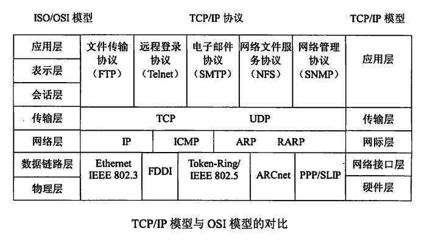

# 计算机网络的相关面试题

## 网络结构

### 你知道TCP协议、IP协议、HTTP协议分别在哪一层吗？

### OSI七层协议模型、TCP/IP四层模型和五层协议体系结构之间的关系

 **一、OSI七层协议模型**

OSI的七层协议主要包括：物理层（physical layer）、数据链路层（data link layer）、网络层（network layer）、运输层（transport layer）、会话层（session layer）、表示层（presentation layer）、应用层（application layer）。

**二、TCP/IP四层协议模型**

TCP/IP是一个四层的体系结构，他包括（从下到上顺序）：网络接口层、网际层（用网际层这个名字是强调这一层是为了解决不同的网络的互联问题）、运输层、应用层。不过从实质上讲，TCP/IP只有最上面的三层，因为最下面的网络接口层并没有具体内容。

**三、五层协议体系结构**

五层体系的协议结构是综合了OSI和TCP/IP的优点的一种协议，包括（从下到上）：物理层、数据链路层、网络层、运输层、应用层。（最底下两层可以称为网络接口层）

注：五层协议的体系结构只是为介绍网络原理而设计的，实际应用还是TCP/IP四层体系结构。

OSI由于体系比较复杂，而且设计先于实现，有许多设计过于思想，不太方便计算机软件实现，因而完全实现OSI参考模型的系统不多，应用的范围有限。而TCP/IP协议最早在计算机系统中实现，在Linux、Windows平台中都有稳定的实现，并且提供了简单方便的编程接口（API），可以在其上开发出丰富的应用程序，因此得到了广泛的应用。TCP/IP协议已成为目前互联网事实上的国际标准和工业标准。

**四、每一层的协议如下：**

**物理层**：RJ45、CLOCK、IEEE802.3（中继器、集线器）

**数据链路层**：PPP、FR、HDLC、VLAN、MAC（网桥、交换机）

**网络层**：IP、ICMP、ARP、RARP、OSPF、IPX、RIP、IGRP（交换机）

**传输层**：TCP、UDP、SPX

**会话层**：NFS、SQL、NETBIOS、RPC

**表示层**：JPEG、MPEG、ASII

**应用层**：FTP、DNS、Telnet、SMTP、HTTP、WWW、NFS

**五、每一层的作用如下：**

1、物理层

主要定义物理设备标准，例如网线的接口类型、光线的接口类型、各种传输介质的传输速率等。他的主要作用是传入比特流（就是由1、0转化为电流强弱来进行传输，到达目的地后再转化为1、0，也就是我们通常所说的数模转换与模数转换）。这一层的数据叫做比特流。。

2、数据链路层

定义了如何让数据格式化进行传输，以及如何让控制对物理介质的访问。这一层通常还提供了错误检测和纠正，以保证数据的可靠传输。

3、网络层

在位于不同地理位置的网络中的两个主机/节点之间提供连接和路径选择。Internet的发展使得从世界各站点访问信息的用户数大大增加，而网络层正是管理这种连接的层。

4、运输层

定义了一些传输数据的协议和端口号（WWW端口80等），如：TCP（传输控制协议TCP，传输效率低，可靠性强，用于传输可靠性要求高，数据量大的数据）和UDP（用户数据报协议UDP，与TCP特性恰恰相反，用于传输可靠性要求不高、数据量小的数据，如QQ聊天数据就是通过这种方式传输的）。主要是将从下层的接收的数据进行分段和传输，到达目的地后再进行传输。常常把这一层数据叫做段。

5、会话层

通过运输层（端口号：传输端口与接收端口）建立数据传输的通路。主要在你的系统之间发起会话或者就受会话请求（设备之间需要相互认识可以是IP地址也可以是MAC地址或者主机名）。

6、表示层

可以确保一个系统的应用层所发送的信息可以被另一个系统的应用层读取。例如，PC程序与另一台程序计算机进行通信，其中一台计算机使用扩展二一十进制交换码（EBCDIC），而另一台则使用美国信息交换标准码（ASCII）来表示相同的字符。如有必要，表示层会通过使用一种通用格式来实现多种数据格式之间的转换。

7、应用层

是最靠近用户的OSI层。这一层为用户的应用程序（如：电子邮件、文件传输和仿真终端）提供网络服务。

## 传输层

### TCP

####  谈一下，为什么tcp为什么要建立连接？

保证可靠传输。

#### 请你解释一下TCP为什么可靠一些

三次握手，超时重传，滑动窗口，拥塞控制。

#### 请说明一下哪种应用场景会使用TCP协议，使用它的意义

当对网络通讯质量有要求的时候，比如：整个数据要准确无误的传递给对方，这往往用于一些要求可靠的应用，比如HTTP、HTTPS、FTP等传输文件的协议，POP、SMTP等邮件传输的协议

#### 简单描述一下，TCP的连接和释放过程。

**三次握手的过程**

1）主机A向主机B发送TCP连接请求数据包，其中包含主机A的初始序列号seq(A)=x。（其中报文中同步标志位SYN=1，ACK=0，表示这是一个TCP连接请求数据报文；序号seq=x，表明传输数据时的第一个数据字节的序号是x）；

2）主机B收到请求后，会发回连接确认数据包。（其中确认报文段中，标识位SYN=1，ACK=1，表示这是一个TCP连接响应数据报文，并含主机B的初始序列号seq(B)=y，以及主机B对主机A初始序列号的确认号ack(B)=seq(A)+1=x+1）

3）第三次，主机A收到主机B的确认报文后，还需作出确认，即发送一个序列号seq(A)=x+1；确认号为ack(A)=y+1的报文；

**四次挥手过程**

假设主机A为客户端，主机B为服务器，其释放TCP连接的过程如下：
1） 关闭客户端到服务器的连接：首先客户端A发送一个FIN，用来关闭客户到服务器的数据传送，然后等待服务器的确认。其中终止标志位FIN=1，序列号seq=u。
2） 服务器收到这个FIN，它发回一个ACK，确认号ack为收到的序号加1。
3） 关闭服务器到客户端的连接：也是发送一个FIN给客户端。

4） 客户段收到FIN后，并发回一个ACK报文确认，并将确认序号seq设置为收到序号加1。 首先进行关闭的一方将执行主动关闭，而另一方执行被动关闭。

